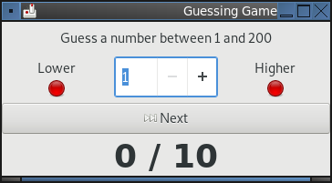
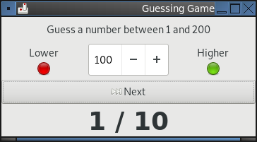
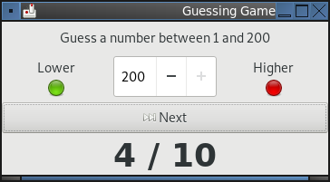
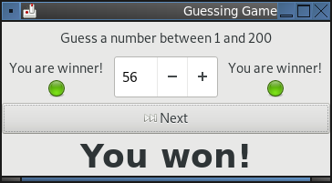
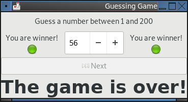

# guessgame

This game has been hardcoded with the most elaborate algorithms in number guessing methodology. Experience the absolute thrill of taking on this game of chance and skill as you are either greeted with the ultimate success or miserable failure of the results of your guess.

## Screenshots
### Before playing

### In play, but you guessed too low

### In play, but you guessed too high

### You lost

### You won

### You kept clicking next for some reason

## Install

1. If you are running Gnome or Unity on Linux with Python 3, you should be able to open
a terminal and type python guessgame.py and have it work without any issues.

2. If you are running Windows, you will need to download and run [this installer](https://sourceforge.net/projects/pygobjectwin32/files/pygi-aio-3.24.1_rev1-setup_049a323fe25432b10f7e9f543b74598d4be74a39.exe/download) before running it in the same way as above.

## Development

To edit the user interface:

1. Download and install the Glade development tool
2. Run Glade
3. Open the guessinggame.glade file
4. Change things
5. Save it.
6. Edit the Python script.
7. Run it.

## Contributors
  * Ethan Dall
  * Kyle Burkett
  * Aaron Gunther
  * Jesse Raines
  * Michael Ranciglio
  * Andrew Smith
  * Stephen Sladek
